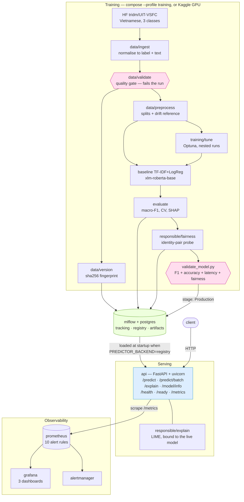
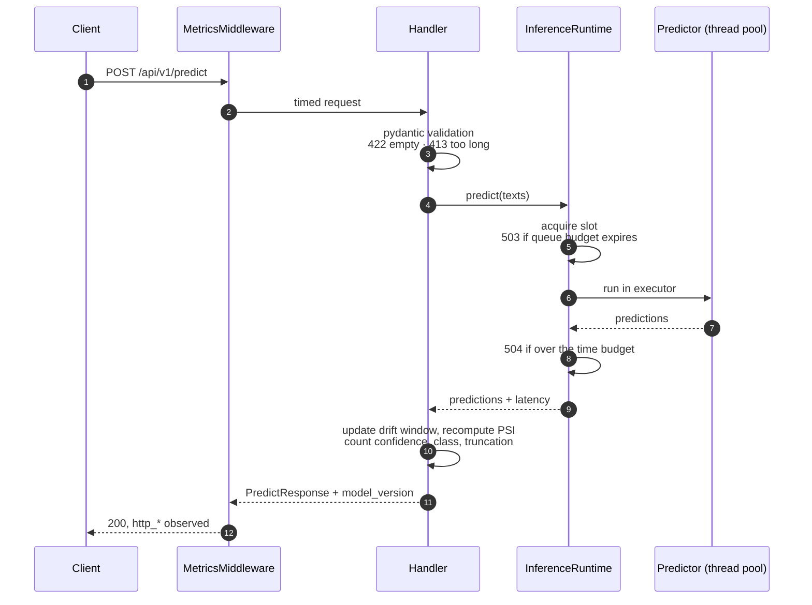

# Architecture — sentiment-service

System design for a Vietnamese sentiment analysis service: a fine-tuned
XLM-RoBERTa classifier served over HTTP, tracked in MLflow, instrumented for
Prometheus, and deployed as six Docker Compose services.

The design rationale behind these choices — including the options rejected — lives in
[`docs/superpowers/specs/2026-08-09-sentiment-service-design.md`](docs/superpowers/specs/2026-08-09-sentiment-service-design.md).
This document describes **what the repository actually contains**, which is not yet
the same thing.

## Current state

The walking skeleton is complete: all six services come up healthy, the HTTP
contract is final, and metrics flow end to end. What runs today differs from the
target design in four ways, listed here rather than buried, so that no reader is
misled by the sections below.

| Area | Today | Target |
|---|---|---|
| Active model | TF-IDF + LogisticRegression baseline, registry version 2, stage `Production` — macro-F1 **0.7149**, accuracy **0.8629** | Fine-tuned XLM-RoBERTa, macro-F1 ≥ 0.80 |
| Fairness | Identity blinding; worst identity-pair delta **0.0000**, gated at promotion and alerted in production | Re-measured on the transformer before it ships |
| Explanations | LIME live on `/api/v1/explain`; SHAP global logged per training run | unchanged |
| Training orchestration | `docker compose --profile training up trainer`, or `scripts/train_model.py` | unchanged |
| Transformer | Trains on Kaggle GPU; **the 200 ms CPU budget is unproven for it** | Measured, or the baseline stays |

Switching the model is a configuration change, not a code change:
`SENTIMENT_PREDICTOR_BACKEND=registry` loads whatever sits in `Production`, baseline or
transformer. That boundary was the point of building the skeleton first, and it is now
exercised rather than theoretical.

## 1. High-level architecture



The two diamond nodes are the gates. Neither is advisory: `data/validate` raises and
stops the run, and `validate_model.py` exits non-zero rather than promoting.

<details>
<summary>The same thing as ASCII, for terminals and diffs</summary>

```
      ┌───── TRAINING (run manually, or on Kaggle GPU — not yet a Compose profile) ─────┐
      │                                                                                │
      │   HF tridm/UIT-VSFC ──▶ tokenise ──▶ fine-tune ──┬── xlm-roberta-base           │
      │   (Vietnamese, 3 classes)                        └── TF-IDF + LogisticRegression│
      │                                                              │                 │
      │   data/ingest ──▶ validate ──▶ preprocess                     │                 │
      │   (quality gate + drift reference;                            │                 │
      │    NOT on the training path today)                            ▼                 │
      │                                                     evaluate (macro-F1)        │
      │                                                              │                 │
      │                                                              ▼                 │
      │                                    MLflow tracking ──────▶ postgres            │
      │                                    artifacts ───────────▶ named volume         │
      │                                                  │                             │
      │                       scripts/validate_model.py: macro-F1 gate → Production     │
      └──────────────────────────────────────────────────┼─────────────────────────────┘
                                                         │ loaded at API startup when
                                                         │ PREDICTOR_BACKEND=registry
   client ──HTTP──▶ ┌──────────────────────────────┐ ◀────┘
                    │  api  (FastAPI + uvicorn)    │
                    │   /api/v1/predict            │
                    │   /api/v1/predict/batch      │
                    │   /api/v1/explain     (503)  │
                    │   /api/v1/model/info         │
                    │   /health  /ready  /metrics  │
                    │                              │
                    │  in-process instrumentation: │
                    │   latency · class dist ·     │
                    │   confidence · PSI drift     │
                    └──────────────┬───────────────┘
                                   │ scrape /metrics
                                   ▼
                          ┌────────────────┐      ┌──────────┐
                          │   prometheus   │─────▶│ grafana  │
                          └───────┬────────┘      └──────────┘
                                  │ 8 alert rules
                                  ▼
                          ┌────────────────┐
                          │  alertmanager  │
                          └────────────────┘
```

</details>

Six services: `api`, `postgres`, `mlflow`, `prometheus`, `alertmanager`, `grafana`.
Every one declares a health check, and `api` waits on `mlflow` being healthy before
it starts.

## 2. Components and responsibilities

| Component | Responsibility | Depends on |
|---|---|---|
| `src/sentiment/data/` | Download, validate and split raw data. Owns the quality gate. | HuggingFace `datasets` |
| `src/sentiment/models/` | Model definitions (`baseline`, `transformer`) and MLflow registry access. | MLflow |
| `src/sentiment/training/` | Orchestrates training, evaluation and promotion. | `data`, `models` |
| `src/sentiment/serving/` | HTTP surface, request validation, inference runtime, instrumentation. | `models.registry` |
| `src/sentiment/responsible/` | Fairness probe, explainers, report generation. **Stubs today.** | the HTTP API only |
| `prometheus/`, `grafana/`, `alertmanager/` | Scrape config, alert rules, provisioned datasource and dashboards. | `serving` metric names |

**Isolation rule.** `serving` reaches the training half of the tree through exactly one
import — `models.registry.load_production_predictor` — and that import sits inside the
predictor factory, so a stub-backed process never imports MLflow or torch at all.

`responsible/fairness.py` is specified to reach the model **over HTTP against the
running service**, never by importing it. This is deliberate: it means the fairness
numbers describe the deployed system, including its preprocessing and truncation, and
are therefore defensible under questioning.

## 3. Data flow

### Training path

`tridm/UIT-VSFC` — Vietnamese student feedback, three classes (`negative`,
`neutral`, `positive`) — is loaded, tokenised to a 256-token window, and used to
fine-tune `xlm-roberta-base`. Because the `neutral` class is heavily
under-represented, training applies balanced class weights through a
`WeightedTrainer` subclass, with early stopping (patience 3), a cosine schedule and
10% warmup. A TF-IDF + LogisticRegression baseline trains from the same data.

Params, metrics and artifacts go to MLflow, backed by postgres for metadata and a
named volume for artifacts. `scripts/validate_model.py` applies the macro-F1
threshold and promotes the run to registry stage `Production`; nothing is promoted by
hand. `scripts/evaluate_model.py` produces a confusion matrix, a classification
report and a per-sample CSV for error analysis.

**Note.** `data/ingest.py` → `data/validate.py` → `data/preprocess.py` implements a
robust, tested path for `amazon_polarity` — schema assertions, empty-text and
duplicate ratios, label balance, seeded stratified splits. Training does not currently
call it. Reconciling the two is tracked as W2-04.

### Training reference for drift

`preprocess.build_drift_reference` emits a reference distribution — an input-length
histogram and the positive-class prior — which training writes to
`drift_reference.json` and logs as an MLflow artifact beside the model. The serving
layer loads it *with* the model. That coupling is what makes the drift metric
meaningful: the reference always matches the model actually serving. When no artifact
is present, serving falls back to a bootstrap reference declared in code.

### Serving path



Inference never touches the event loop, and every failure mode above is a typed error
rather than a 500. The instrumentation step is inside the request, not a background
job, because drift and confidence are functions of the prediction itself.

Request → pydantic validation → inference in a bounded thread pool → response.

Inference never runs on the event loop. `InferenceRuntime` owns a semaphore sized to
`max_concurrent_inferences` and a matching `ThreadPoolExecutor`; a request that cannot
acquire a slot within `queue_timeout_seconds` is rejected rather than queued
indefinitely, and one that exceeds `inference_timeout_seconds` is abandoned with the
slot released by a done-callback. Model reloads warm a replacement first and publish
it atomically, so a failed reload leaves the previous model serving.

In the same call the API updates its rolling window of input lengths and confidences
and recomputes PSI against the reference. Every response carries `model_version`, so a
prediction can always be traced back to an MLflow run.

### Edge cases handled explicitly

| Input | Behaviour |
|---|---|
| Empty or whitespace-only text | `422 empty_text` |
| Text over `max_text_length` (default 5,000 chars) | `413 text_too_long` |
| Batch over `max_batch_size` (default 64) | `413 batch_too_large` |
| Request body over `max_request_body_bytes` | `413` from the middleware |
| Text longer than the model's token window | truncated, with `truncated: true` in the response |
| Batch mixing valid and invalid items | per-item results, each carrying exactly one of `prediction` or `error`; HTTP 200 with 207-style semantics in the body |
| Model not loaded | `503 model_not_ready` from `/ready` and from every prediction endpoint |
| Inference capacity full / too slow | `503` overload, `504` timeout |
| Non-ASCII and emoji input | preserved through the contract; covered by `test_unicode_and_emoji_are_preserved_by_the_contract` |

## 4. Technology choices and trade-offs

| Decision | Chosen | Alternatives considered | Rationale / trade-off |
|---|---|---|---|
| Serving framework | FastAPI | Flask, BentoML | Generates the OpenAPI document the rubric requires for free; async I/O; pydantic validation doubles as the request-contract test. Flask would need extra libraries for the same. |
| Model | `xlm-roberta-base` (+ TF-IDF/LogReg baseline) | DistilBERT, BERT-base, PhoBERT, LinearSVC only | The dataset is Vietnamese, so an English-only DistilBERT is not a candidate. XLM-RoBERTa is multilingual, which turns "multi-language support" — a challenge the brief names for this topic — into a property of the design rather than future work. **Trade-off, stated plainly:** it is roughly four times the size of DistilBERT, so the 200 ms p95 CPU budget is now an open risk rather than a settled one. PhoBERT would likely be more accurate on Vietnamese but gives up the multilingual claim. The classical baseline is kept because it makes the experiment comparison honest and gives CI a model it can load in milliseconds. |
| Tracking | MLflow + postgres | Weights & Biases, file backend | Named in the brief; a postgres backend store demonstrates a real backend and survives container restarts, at the cost of one more service. |
| Metrics | `prometheus_client`, in-process | Sidecar exporter, StatsD | Drift and confidence are functions of the prediction itself; exporting them from anywhere else would mean shipping predictions to a second process for no benefit. |
| Drift measure | PSI on input length + class prior | KS test, KL divergence, Evidently | PSI has a conventional interpretation (< 0.1 stable, 0.1–0.2 moderate, > 0.2 significant), which justifies a concrete alert threshold instead of an arbitrary one. |
| Fairness benchmark | Equity Evaluation Corpus | Demographic groupby, Fairlearn on tabular attributes | Review datasets carry no demographic columns, so group-wise metrics are impossible. EEC probes the *model* with minimally-different sentence pairs, the established method for this task (Kiritchenko & Mohammad, 2018). |
| Explainability | SHAP (global) + LIME (local) | Attention weights, Integrated Gradients | The rubric's "Excellent" band asks for multiple methods. Attention weights are contested as explanations; SHAP and LIME are defensible. |
| Orchestration | Docker Compose | Kubernetes, plain Docker | Required by the brief. Training is intended to become a Compose profile so it can share one file with serving; that profile is not written yet, so training currently runs outside Compose. |
| Container hardening | Multi-stage, non-root, pinned base digest, build tools stripped | Single-stage `python:3.11` | The runtime image carries no `pip`, `setuptools` or `wheel`, runs as UID 1000, and pins the base image by digest so a rebuild cannot silently change the OS. CI additionally runs a Trivy scan and emits a CycloneDX SBOM. |
| Lint & format | flake8 + black + isort, all pinned | ruff | ruff is faster and would replace all three, but the course taught this toolchain, Lab 3's CI already runs it, and pinned versions mean a new release cannot turn the build red without a code change. Consistency with the graded labs outweighs the speed. |
| Repo layout | `src/` package + root `prometheus/`, `grafana/`, `scripts/` | flat `app/` as in Labs 1–4 | The `src/` layout prevents accidental imports from the working directory; the root monitoring and script directories match Lab 4, so its dashboards and Compose mounts port over unmodified. |
| Python version | `>=3.10`, CI matrix 3.10 and 3.11 | pin 3.11 exactly | Matches Lab 3. Testing both versions catches version-dependent behaviour that a single pin hides — it already caught an `asyncio.timeout` incompatibility on 3.10. |

**Scalability.** Single-replica CPU inference is the target. Horizontal scaling would
work — the API is stateless apart from the in-memory drift window, which would need
moving to a shared store — and this limitation is documented rather than engineered
around.

**Cost.** Everything runs on a laptop. The largest cost is the initial dataset
download; GPU fine-tuning is done on Kaggle's free tier.

**Complexity.** Six services is the deliberate ceiling. A feedback loop and
retraining scheduler were designed and rejected for this timeline: they roughly double
the service count for a narrative benefit the drift metric already delivers, and they
are the component most likely to be half-finished at a deadline.

## 5. Not built yet

Stated explicitly so that this document can be trusted where it does make a claim:

- **The fine-tuned transformer.** `TransformerPredictor` loads and satisfies the serving
  contract, and the training pipeline runs, but no fine-tuned checkpoint has been
  promoted. Every model figure quoted here is the baseline's.
- **The transformer's latency.** `xlm-roberta-base` is roughly four times DistilBERT's
  size, and the 200 ms p95 CPU budget has not been measured for it. This is the largest
  open technical risk in the project, not a formality.
- **Aspect-based sentiment, sarcasm, and continuous retraining.** Scoped out with
  reasons in [`docs/PROBLEM.md`](docs/PROBLEM.md) §6.
- **Horizontal scaling.** The drift window is in-memory, so a second replica would
  compute drift against its own partial view.
- **PII scrubbing.** Not implemented, because nothing is stored. Becomes mandatory the
  moment a feedback endpoint or request logging is added — see
  [`docs/ETHICS.md`](docs/ETHICS.md) §2.

## See also

- [`README.md`](README.md) — quickstart, API examples, troubleshooting
- [`CONTRIBUTING.md`](CONTRIBUTING.md) — team roles and the working agreement
- [`docs/api.md`](docs/api.md) — endpoint reference
- [`docs/user-guide.md`](docs/user-guide.md) — operations and alert runbooks
- [`docs/TESTING_STRATEGY.md`](docs/TESTING_STRATEGY.md) — the four test types
- [`TASKS.md`](TASKS.md) — task board and current status
